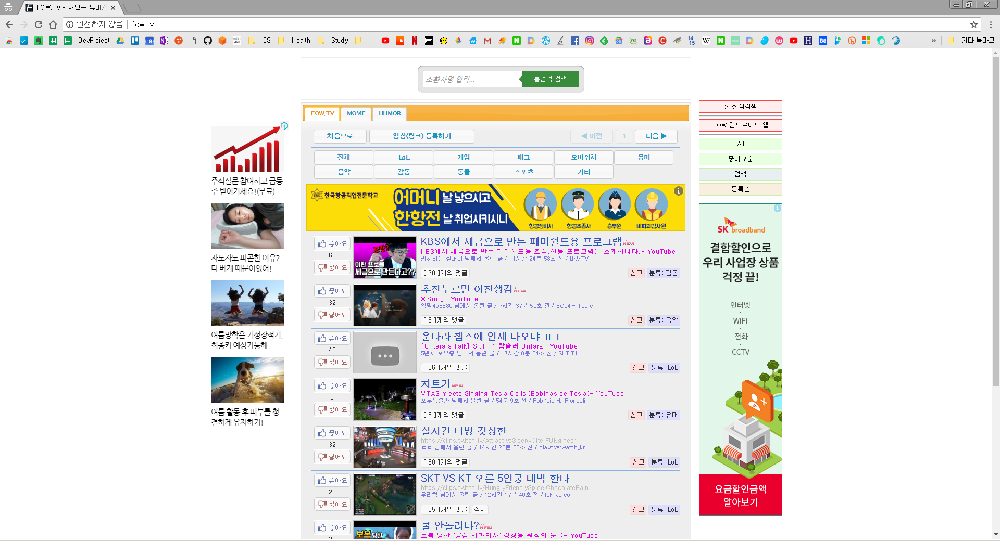
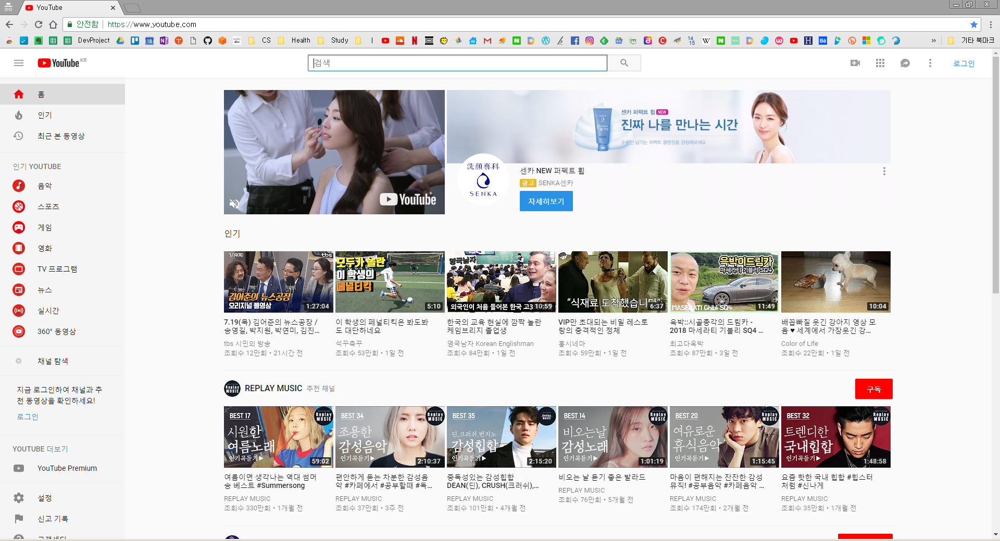
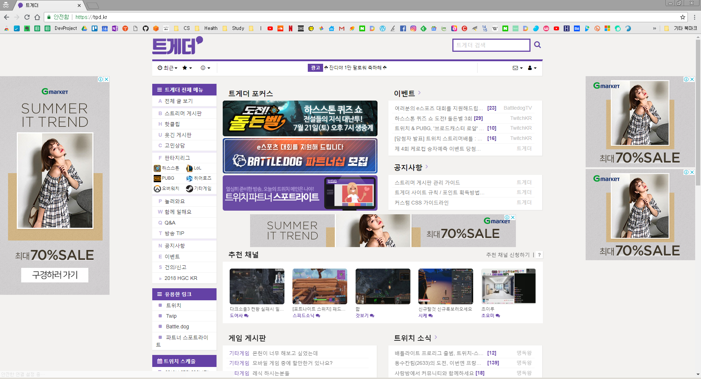

# KLY PROJECT

## 목차
- [소개](#소개)
	- [1.우리는](#1-우리는)
	- [2.우리가 만드는 것은?](#2-우리가-만드는-것은)
	- [3.왜 만드나?](#3-왜-만드나)
	- [4. 어떻게 할려고?](#4-어떻게-할려고)
		- [4.1 예상 화면](#41-예상-화면)
		- [4.2 기술 스택](#42-기술-스택)
		- [4.3 일정](#43-일정)

## 소개
### 1. 우리는?

- 김준호, 이성준, 윤다형으로 구성
- 서비스의 예명 : kly(팀원의 성 두문자어)

### 2. 우리가 만드는 것은?
- 유튜브와 같은 동영상 공유 플랫폼 서비스
- 벤치마킹 한 서비스
	- fow.tv : 롤 전적 검색 사이트에서 제공하는 영상 공유 게시판
	- youtube : 세계 최대의 동영상 공유 서비스
	- 트게더 : 트위치 TV 영상을 주 컨텐츠로 하는 한국 커뮤니티 사이트
	- OP.GG 커뮤니티 : 롤 전적 검색 사이트 OP.GG에서 운영하는 커뮤니티 사이트
- 이들과 우리의 차이점
	- 비회원의 글쓰기 제한
	- 다양한 영상의 공유
	- '3. 왜 만드나?'에서 자세히 설명

### 3. 왜 만드나?
- 거시적으로는 벤치마킹 사이트에 대한 불편을 해소하기 위해
	- fow.tv, OP.GG : 비회원의 댓글 작성이 가능하며, 댓글의 비방 정도, 욕설 정도가 상대적으로 많은 편
	- 트게더 : 트위치 TV 영상 외에 영상이 없음.
	- youtube : 타 플랫폼의 영상을 볼 수 없음.
	- OP.GG : 업로드의 제한은 아니나, 사람들이 공유하는 주제가 거의 LOL로 한정되어 있음
- 댓글 및 게시물의 문제(질적 관리)
	- 회원제 시스템, 신고와 그에 따른 차단 기능을 통해 게시물 및 댓글 관리
	- 비회원은 모든 댓글 및 게시글에 대한 조회만 가능
- 영상의 주제와 플랫폼의 한정에 대한 해결
	- 외부 공유링크를 제공하는 모든 영상에 대한 공유 가능
	- 주제에 대한 제한이 없음

### 4. 어떻게 할려고?
#### 4.1 예상 화면
- 예시 1. [fow.tv](http://fow.tv/)

- 예시 2. [유튜브](https://www.youtube.com/)

- 예시 3. [트게더](https://tgd.kr/)

#### 4.2 기술 스택
- Front-end
	- HTML5, CSS3
	- Library : bootstrap 4.1, jQuery
		
- Back-end
	- java(JSP 2.3/Servlet 3.1)
- DB
	- Oracle 11g
- CM
	- (github / source Tree)

#### 4.3 일정
- 일정
	- 요구사항 분석 : 7/17(tue) ~ 7/19(fri) / 7/30(mon)
	- 설계 : 7/20(fri) / 7/30(mon)
	- 구현 : 7/23(mon) ~ 7/27(fri) / 7/31(tue) ~ 8/2(thu)
	- 테스트 : 8/3(fri) ~ 8/6(mon)
- 특이사항
	- 스프린트를 1주일 단위로 가져갈 예정
	- 일주일에 1.0.0씩 업데이트
	- 스프린트 단위당 설계한 것 이상의 것은 개발하지 않음(필요 시 다음 스프린트에)
	- 스프린트 기간 내에 다 끝내지 못해도 스프린트는 종료
